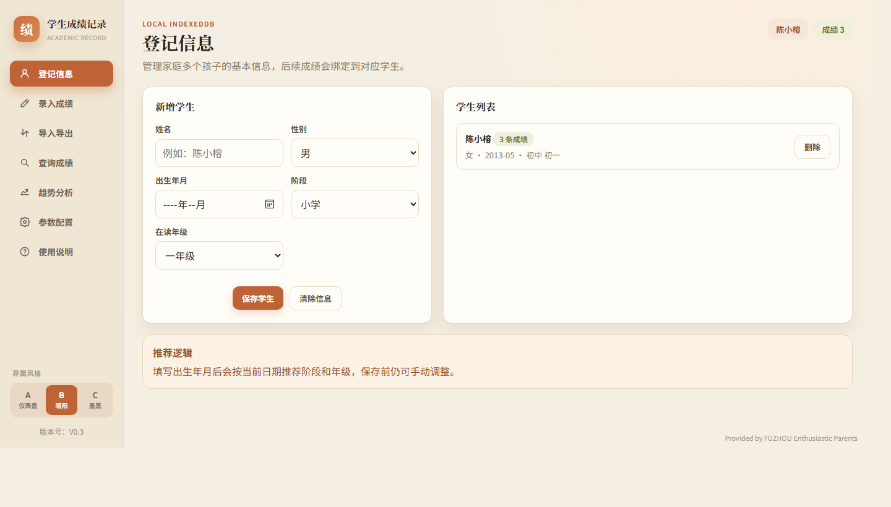
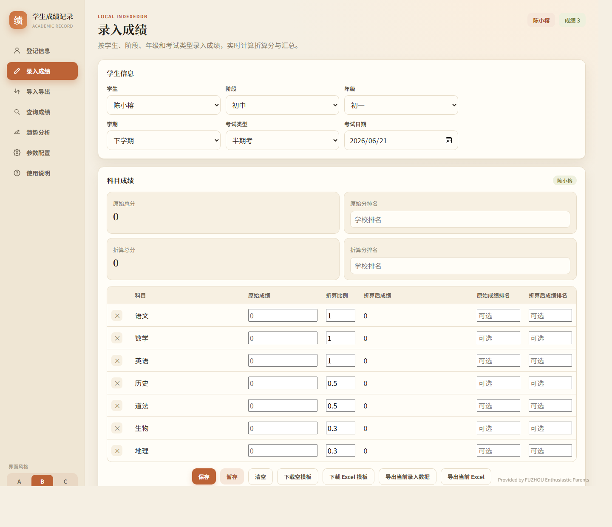
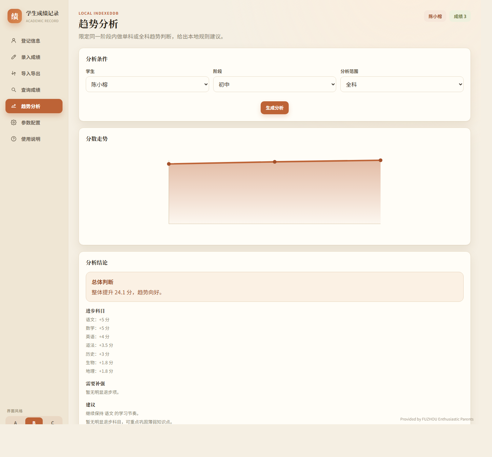
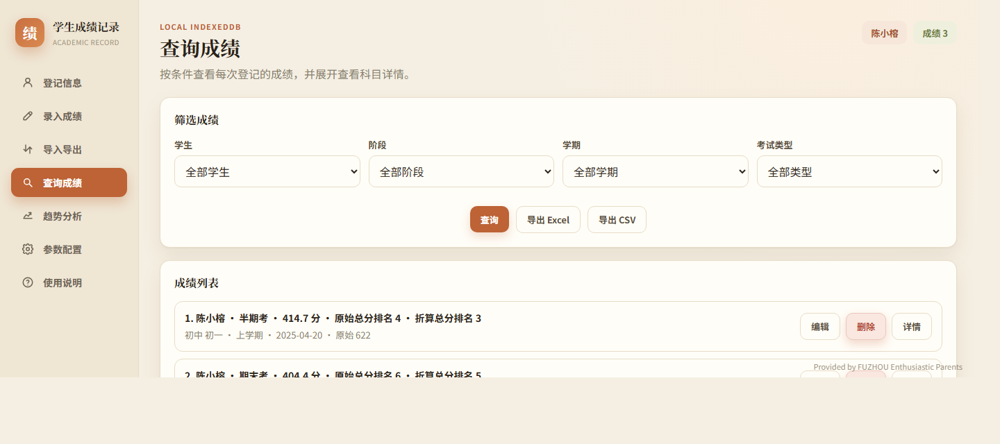
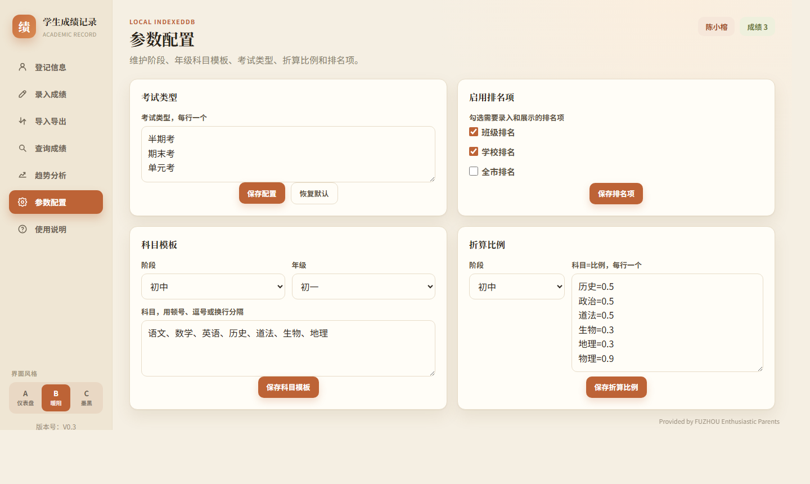
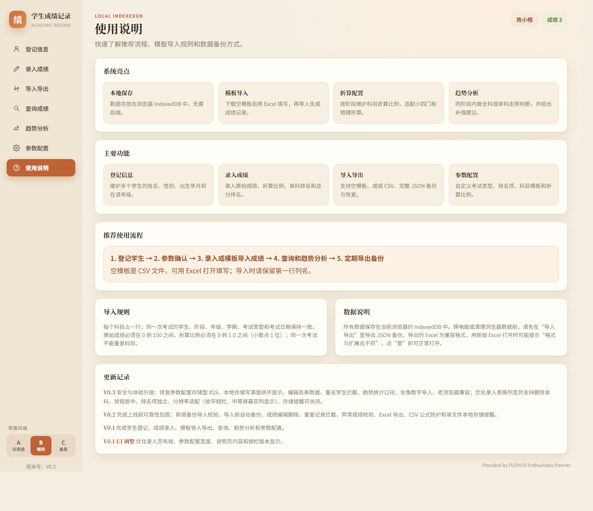

# 学生成绩记录 · Academic Record

一个**纯前端、单文件**的学生成绩记录与分析工具，面向家长记录孩子各科成绩。数据保存在本机浏览器，**无需服务器、无需联网、无任何第三方依赖**。

> 双击 `学生成绩记录-美化版.html` 即可在浏览器中打开使用。

## 界面预览

### 登记信息 · 录入成绩

### 趋势分析 · 查询成绩

### 参数配置 · 使用说明

## 功能特性

- **多孩子管理**：登记家庭多个孩子，成绩按学生归档
- **成绩录入**：按阶段 / 年级 / 考试类型录入，实时计算折算分与总分
- **折算比例**：按阶段维护科目折算比例（适配中考小四门折算）
- **导入导出**：空模板下载、CSV / Excel 成绩导入导出、完整 JSON 备份与恢复
- **查询筛选**：按学生 / 阶段 / 学期 / 考试类型筛选，展开查看科目详情
- **趋势分析**：同阶段单科或全科走势判断，给出进步 / 补强建议
- **参数配置**：自定义考试类型、年级科目模板、折算比例、排名项
- **三套主题**：仪表盘（A）/ 暖阳（B）/ 墨黑（C）
- **响应式**：适配 20–24 寸常见显示器，中等屏幕双列布局

## 快速开始

1. 下载 `学生成绩记录-美化版.html`
2. 双击用浏览器打开（推荐最新版 Chrome / Edge）
3. 「登记信息」添加孩子 → 「录入成绩」或「导入导出」录入成绩 → 「查询成绩 / 趋势分析」查看

> **存储模式**：双击打开为单文件本地模式，使用浏览器 localStorage（约 5MB）；若用本地静态服务器打开（如 `python -m http.server`），则使用 IndexedDB（容量更大）。

## 数据与隐私

- 所有数据**仅保存在你自己的浏览器本地**（IndexedDB 或 localStorage），不上传任何服务器
- 换电脑、换浏览器或清理浏览器数据前，请在「导入导出」中**导出 JSON 备份**
- 导入备份前会自动备份当前数据，并对导入内容做完整字段校验

## 技术栈

- 单个 HTML 文件，内联 CSS + 原生 JavaScript（ES Module）
- 存储：IndexedDB，自动降级 localStorage / 内存
- 无构建、无框架、无第三方运行时依赖

## 更新记录

- **V0.3** 安全加固（修复参数配置存储型 XSS、CSV 公式注入防护）、数据修复（编辑态串数据、重名学生拦截、趋势统计口径、全角数字导入、0 分可保存等）、界面优化（分辨率适配、录入表格列宽、排名项独立、按钮对齐、存储提醒可按版本关闭）、导入规则调整（原始成绩 0–150、折算比例 0–1.0）、老浏览器兼容
- **V0.2** 上线前可靠性加固：备份导入校验、导入前自动备份、成绩编辑删除、重复记录拦截、异常成绩校验、Excel 导出、CSV 公式防护、单文件本地存储提醒
- **V0.1** 学生登记、成绩录入、模板导入导出、查询、趋势分析、参数配置

---

Provided by FUZHOU Enthusiastic Parents
